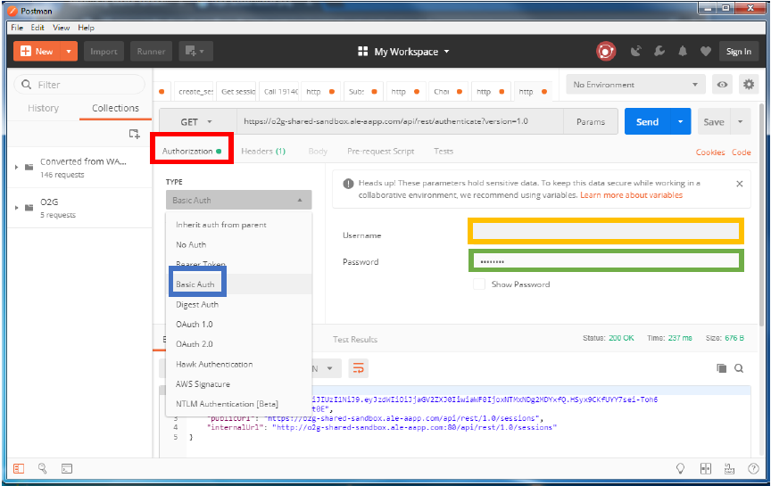
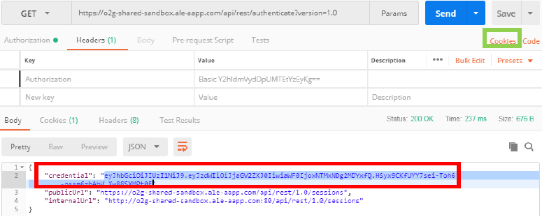
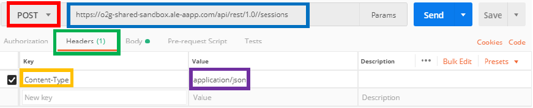
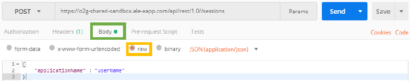

To log in the API, you <b>have to authenticate</b> yourself, and then <b>create a session</b> with your user name.

---

## Authentification

* First, enter this URL : https://o2g-shared-sandbox.ale-aapp.com/api/rest/authenticate?version=1.0 in the field provided for this effect with the GET request.

---

* Then go to the "Authorization" tab then choose the type "Basic Auth" and enter your login in "Username" and password in "Password" in the fields below.

---

* If you have the "Status: 200 OK", the query succeded.
* Now, you have your Cookie which will serve you to authenticate you during the next queries. It is automatically saved in the "Cookie" tab.

* You can manually enter the Alcatel Cookie, but it's really not practical. For your information, to do that by hand you have to fill the <b>KEY</b> in the Headers by "Cookie" with the <b>VALUE</b> "AlcUserId=*yourCookieValue*".

---

## Create a session

* Now that you have the registered authentication cookie, you can open your session by using the POST request with the following URL https://o2g-shared-sandbox.ale-aapp.com/api/rest/1.0//sessions , and by adding in the Header tab the "Content-Type" key and the « application/json » value.

---

* Then in the "Body" tab, activate the "raw" button then select "JSON", then copy the body as the example below and replace the "userName" with your own application name.

* If you have the "Status: 200 OK", the query succeded.