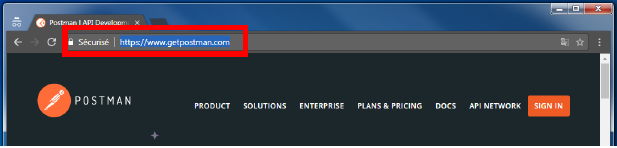
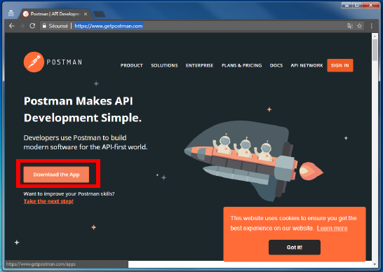
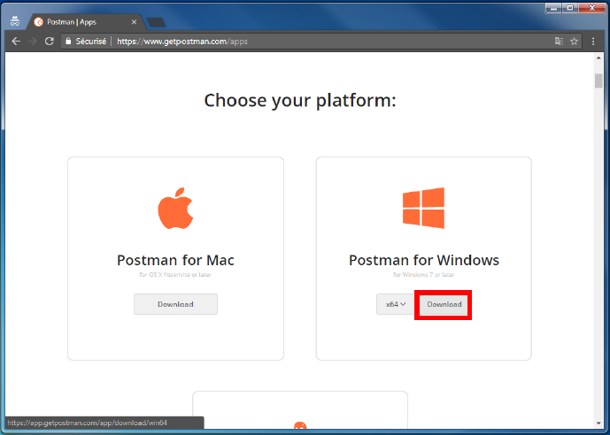
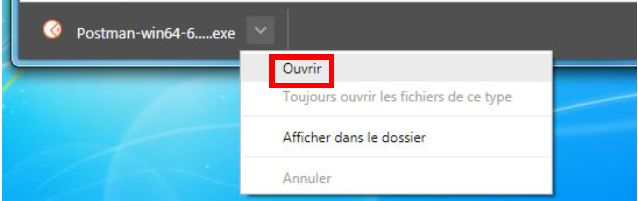
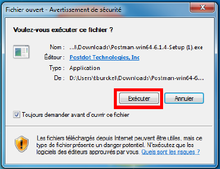

## Download Postman

* Open a web browser, like Google Chrome or Firefoxe
* In the URL bar, type `https://www.getpostman.com` and push "ENTER"

* Click on "Download the App"

* Select your platform (in this exemple it's Windows) and click on "Download"

## Installation

* When the download is done, click on "Open"

then "Execute" and finish your setup as you want.

