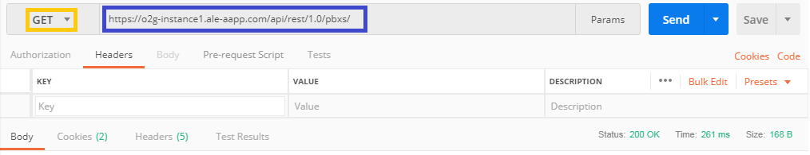
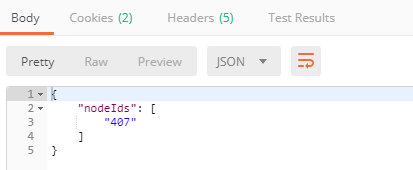
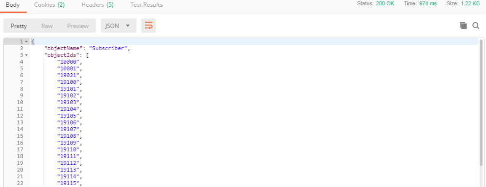
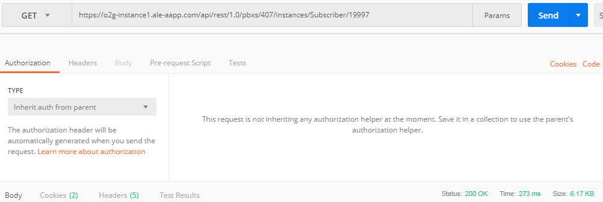
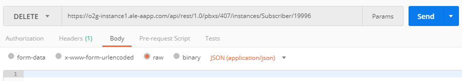

## Find your PBX nodeId

* First you need to GET the nodeId of your PBX with this URL : https://o2g-instance1.ale-aapp.com/api/rest/1.0/pbxs/

* If the request worked you have a "Status: 200 OK" and this type of body with your nodeIds :

---

## Check for a free number

* To check all the number used, you can do a GET on  https://o2g-instance1.ale-aapp.com/api/rest/1.0/pbxs/407/instances/Subscriber  and find if a phone number is used or not.

___

## Create a new user

You need an Admin account for this query.

* Now you can complete this URL : https://o2g-instance1.ale-aapp.com/api/rest/1.0/pbxs/407/instances/Subscriber  with your own nodeIds do a POST query and fill the in JSON body as below : 
##
    {
        "attributes": [
        {
            "name": "Directory_Number",
            "value": ["19999"]
        },
 		{
            "name": "Annu_Name",
            "value": ["Darmon"]
 		},
 		{
            "name": "Annu_First_Name",
            "value": ["Gerard"]
 		},
        {
            "name": "Cost_Center_Name",
            "value": ["administrator1"]
        },
        {
            "name": "ClickAndPh",
            "value": ["A4980_Pro"]
        },
        {
            "name": "Station_Type",
            "value": ["SIP_Extension"]
        }
        ]
    }

* If you have the "Status: 201 Created", the query succeded.

---

## Get all information about user

When you create a user, all the value that you don't set, will be set by default. If you do this query, you will be able to see <b>all the settings that you can do on a single user</b>.
In this case, i want to see all informations about user 19997.

* You juste have to do a GET with this URL https://o2g-instance1.ale-aapp.com/api/rest/1.0/pbxs/407/instances/Subscriber/19997

* And you will have informations like this

* If you have the "Status: 200 OK", the query succeded.

___

## Edit a user

If you want to change one (or more) parameter on an existant user, you have to do that :
In this example, I want to change the name and the first name of the user 19996.

* Do a PUT with URL https://o2g-instance1.ale-aapp.com/api/rest/1.0/pbxs/407/instances/Subscriber/19996 and fill the body like this in RAW JSON

##
    {
        "attributes": [
 		{
            "name": "Annu_Name",
            "value": ["Pitiot"]
 		},
 		{
            "name": "Annu_First_Name",
            "value": ["Franck"]
 		}
        ]
    }

* If you have the "Status: 204 NO Content", the query succeded.

---

## Delete a user

I want to delete user 19996

* Juste do a DELETE with URL https://o2g-instance1.ale-aapp.com/api/rest/1.0/pbxs/407/instances/Subscriber/19996

* If you have the "Status: 204 No Content", the query succeded.

---

