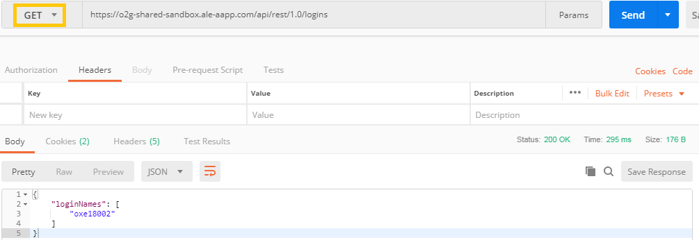
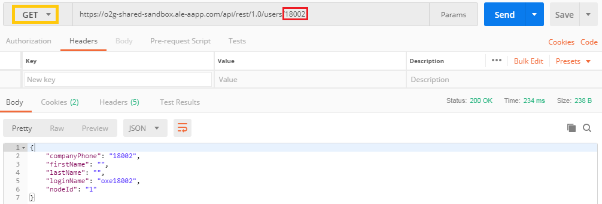
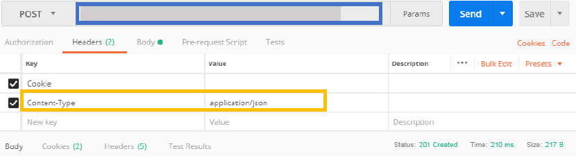
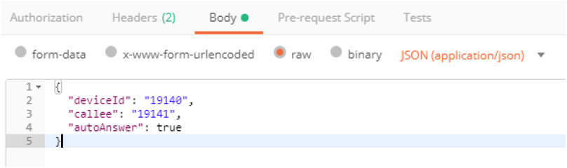

## See all users

* Begging with a GET request with this URL :  `https://o2g-shared-sandbox.ale-aapp.com/api/rest/1.0/logins`

* If you have "Status: 200 OK", the query succeded.

If you are an admin, you will be able to see all the users you administate. In this case, I can only see my username because I'm not log in as administator account.

---

## Informations of one user

In this exemple, we want the informations of user named "oxe18002"

* Make a GET request with https://o2g-shared-sandbox.ale-aapp.com/api/rest/1.0/users/18002

* If you have "Status: 200 OK", the query succeded.

With this query, you will be able to find a phone number for exemple, it's very useful.

---

## Make a Call

For the example, we are the user with the number 19140, and we will call the number 19141.

* Let's start by taking a <b>POST</b> method with the URL  https://o2g-shared-sandbox.ale-aapp.com/api/rest/1.0/telephony/basicCall and fill in the Header with the key "Content-Type" which has for value "application/json".

* In the <b>Body</b>, we will fill it in this way, again with the <b>raw</b> format and <b>JSON</b> enabled.

* If you have the "Status: 201 Created", the query succeded.

---

*Good job ! You're now able to hack the NASA !*

---