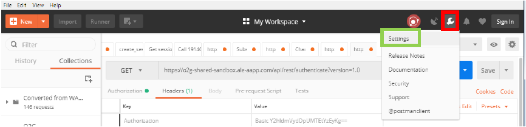
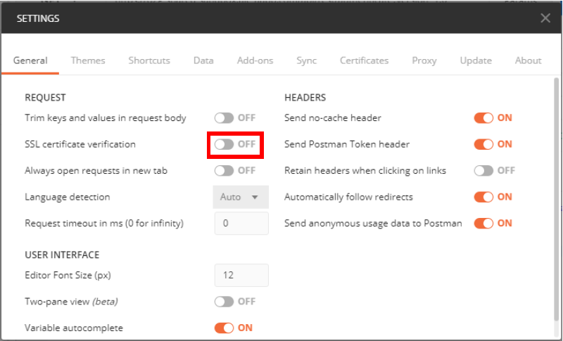

## URL

During all this tutorial i will use this URL : `https://o2g-shared-sandbox.ale-aapp.com/api/rest/1.0/` it may be different from yours but you can replace it with your own !

---

## Settings

The SSL certificate is not yet valid, you need to allow Postman to use URL without SSL.

* First, click on the "Spanner" icon, then on "Settings"

* Then click on "SSL certificate verication" to be in the "OFF" position.

Now that we have "Postman", here are the first essential queries to use the O2G API.