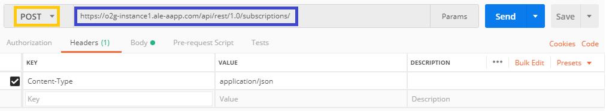
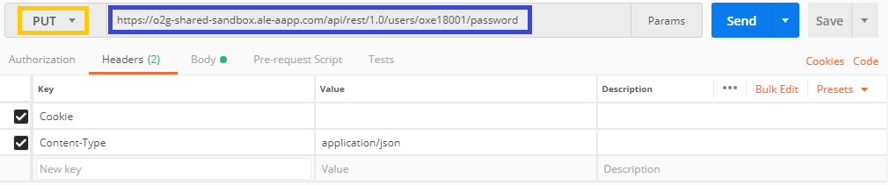
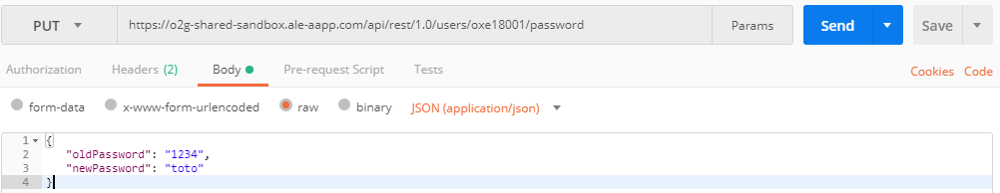
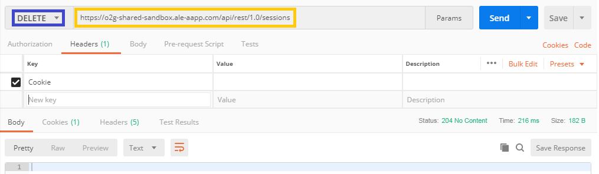

## Subscription for event notification

For this exemple, I want to subscribe to events to user oxe18013

* Make a POST request with this URL   https://o2g-shared-sandbox.ale-aapp.com/api/rest/1.0/subscriptions/

* Fill the body as below in "raw", "JSON"

##

    {
        "filter": 
        {
            "selectors":
	       [ 
            {"ids": [ "oxe18013" ],"names": [ "telephony" ]},
            {"ids": [ "oxe18013" ],"names": [ "eventSummary" ]}
	       ]
        },
    "version":"1.0"
    }

* If you have "Status: 200 OK", the query succeded.

---

## Change a Password

You have to connect with an <b>Admin account</b> to do this request !

Let's take for exemple a user called oxe18001 who have "1234" as password, and we want to change it to "toto".

* Do a PUT request with   https://o2g-shared-sandbox.ale-aapp.com/api/rest/1.0/users/oxe18001/password as URL.

* Complete the body as below :

##
        {
            "oldPassword":"1234"
            "newPassword":"toto"
        }

* If you have the "Status: 204 No Content", the request worked !

---

## Log out

To disconnect your account you have to DELETE your session.

* So, make a DELETE requery with `https://o2g-shared-sandbox.ale-aapp.com/api/rest/1.0/sessions` as URL.

* If you have the "Status: 204 No Content", the query succeded !

---