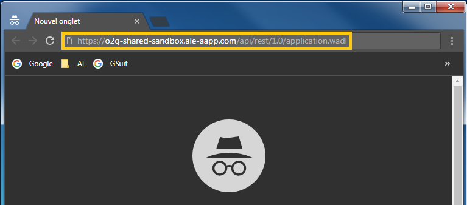
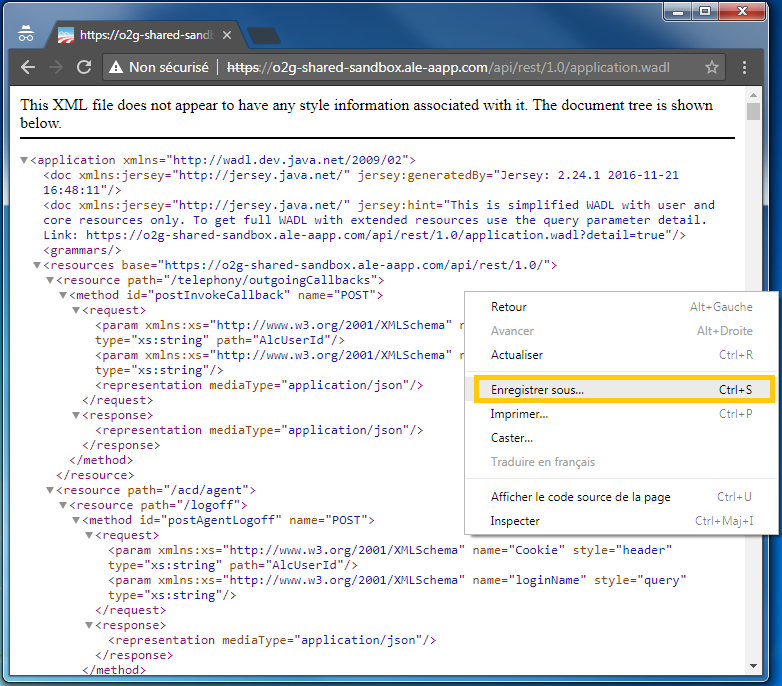
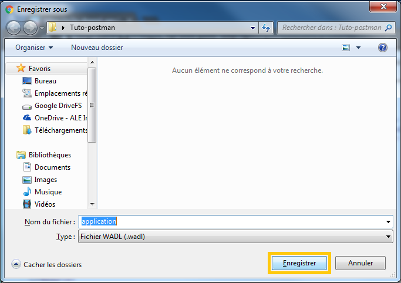
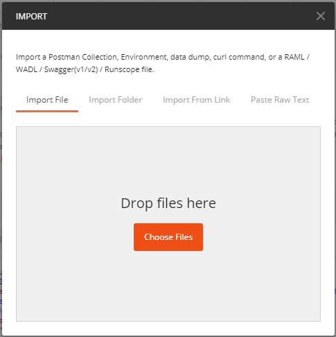
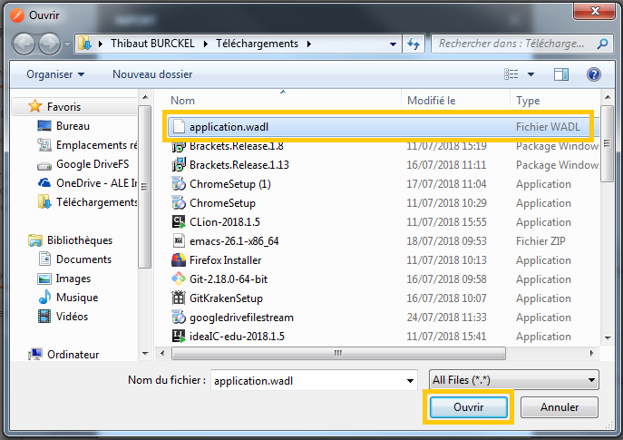
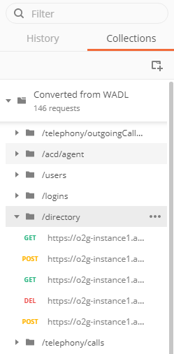

## Download WADL

If you want to have all the URL query in a Collection in postman, you need to download the wadl file from the O2G API.

* First, open a browser and enter this URL  `https://o2g-shared-sandbox.ale-aapp.com/api/rest/1.0/application.wadl`

* Then you need to save the file. You can make `Ctrl + s` or a right click in the middle of the page and then <b>Save as</b>

and then <b>Save</b>

## Import WADL

* Now, you can open Postman and make `Ctrl + o`, click on <b>"Choose file"</b>

select <b>application.wald</b> and click <b>Open</b>.

* Now you have all the URL for query in the "<b>Collections</b>" tab.

